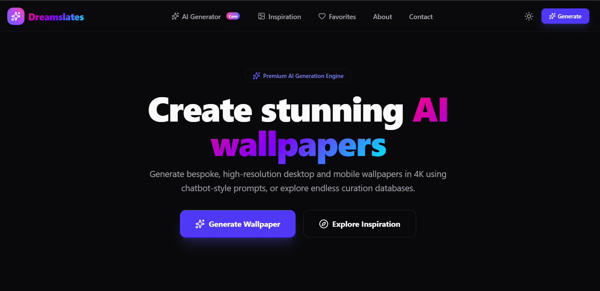
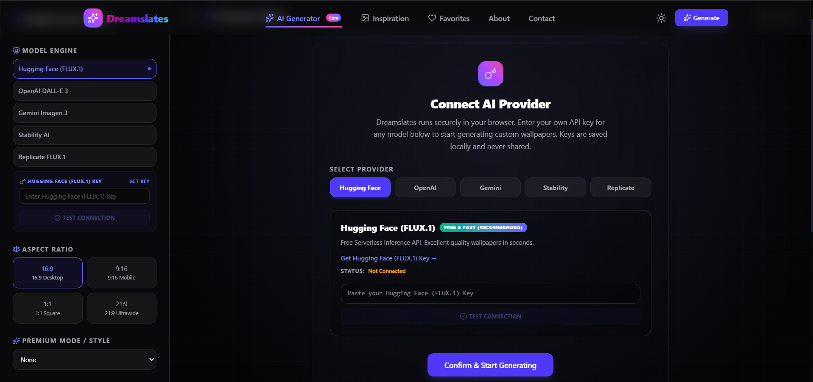
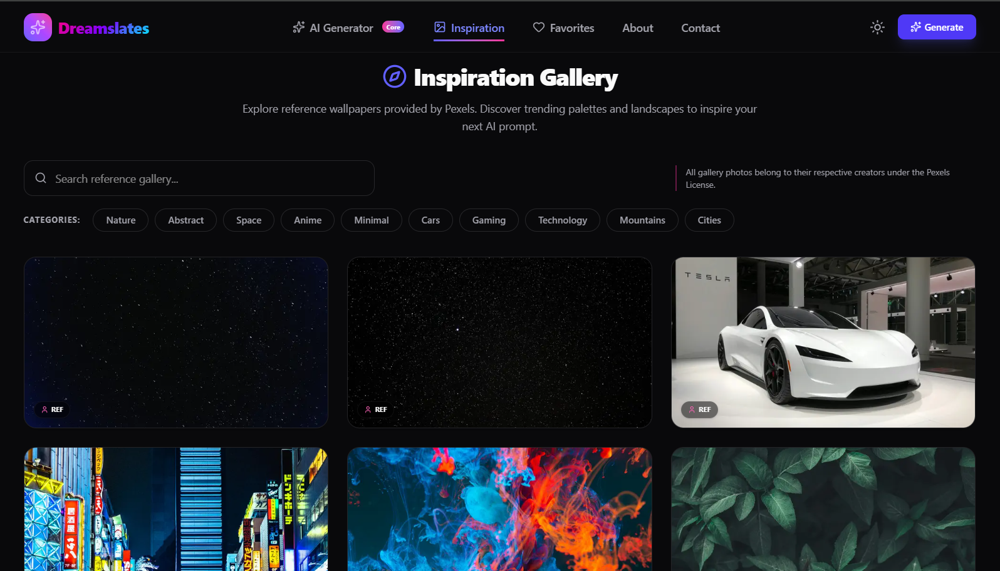
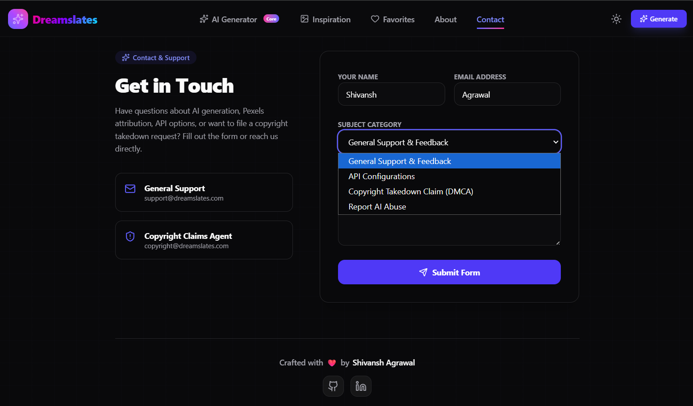

# Dreamslates

A modern wallpaper generation platform built with **Next.js 15**, **TypeScript**, and **Tailwind CSS**. Dreamslates provides a premium interface for generating AI wallpapers using a secure **Bring Your Own API Key (BYOK)** approach, allowing users to connect their preferred AI provider directly from the browser.

**Live Demo:** https://dreamslates.vercel.app

---

## Overview

Dreamslates is designed to make AI wallpaper generation simple, fast, and visually appealing without relying on a centralized backend.

Instead of requiring users to use a shared API service, the platform follows a **Bring Your Own API Key (BYOK)** architecture. Users can securely connect their preferred AI provider, generate wallpapers, browse inspiration from Pexels, save favorites locally, and download wallpapers through an intuitive, glassmorphism-inspired interface.

The project emphasizes clean UI design, modular architecture, responsiveness, and production-ready code quality.

---

# Preview

### Home



### AI Generator



### Inspiration Gallery



### Contact



---

# Features

## AI Wallpaper Generator

- Conversational prompt-based wallpaper generation
- Support for multiple AI providers
- Clean chatbot-style interface
- Prompt history
- Quick regenerate workflow
- Download generated wallpapers

---

## Bring Your Own API Key (BYOK)

Dreamslates never requires users to share API keys with a third-party server.

Supported providers include:

- Hugging Face (FLUX.1)
- OpenAI DALL·E 3
- Gemini Imagen
- Stability AI
- Replicate FLUX.1

API credentials are stored locally in the browser for a secure user experience.

---

## Inspiration Gallery

Powered by the **Pexels API**, the gallery includes:

- High-quality wallpaper discovery
- Infinite scrolling
- Search functionality
- Responsive image grid
- One-click downloads

---

## Favorites

- Save wallpapers locally
- Persistent storage using Zustand
- Instant access to saved wallpapers

---

## User Experience

- Glassmorphism-inspired interface
- Fully responsive layout
- Smooth page transitions
- Framer Motion animations
- Dark theme optimized for desktop and mobile

---

## Safety & Validation

- Prompt moderation
- Provider validation
- Secure client-side key management
- Error handling with user-friendly feedback

---

# Tech Stack

| Category | Technology |
|-----------|------------|
| Framework | Next.js 15 (App Router) |
| Language | TypeScript |
| Styling | Tailwind CSS |
| State Management | Zustand |
| Animation | Framer Motion |
| Icons | Lucide React |
| Image Source | Pexels API |
| Deployment | Vercel |

---

# Project Structure

```text
app/            Next.js App Router pages
components/     Reusable UI components
lib/            API integrations and utilities
store/          Zustand state management
types/          TypeScript definitions
public/         Static assets
```

---

# Getting Started

## Clone the repository

```bash
git clone https://github.com/shivanshagrawal-27/dreamslates.git
```

## Navigate to the project

```bash
cd dreamslates
```

## Install dependencies

```bash
npm install
```

## Configure environment variables

Create a `.env.local` file in the project root.

```env
OPENAI_API_KEY=
PEXELS_API_KEY=
GEMINI_API_KEY=
STABILITY_API_KEY=
REPLICATE_API_TOKEN=
```

Only configure the providers you intend to use.

---

## Run the development server

```bash
npm run dev
```

Then open:

```
http://localhost:3000
```

> If port **3000** is unavailable, Next.js will automatically use the next available port.

---

## Build for Production

```bash
npm run build
```

---

# Deployment

Dreamslates is deployed on **Vercel**.

To deploy your own copy:

1. Fork or clone this repository.
2. Import the project into Vercel.
3. Configure the required environment variables.
4. Deploy.

---

# Future Improvements

- User authentication
- Cloud synchronization for favorites
- AI prompt enhancement
- Wallpaper collections
- Community sharing
- Theme customization
- Download analytics

---

# Author

**Shivansh Agrawal**

B.Tech CSE (Data Science)

GitHub  
https://github.com/shivanshagrawal-27

LinkedIn  
https://www.linkedin.com/in/shivanshcodes/

---

